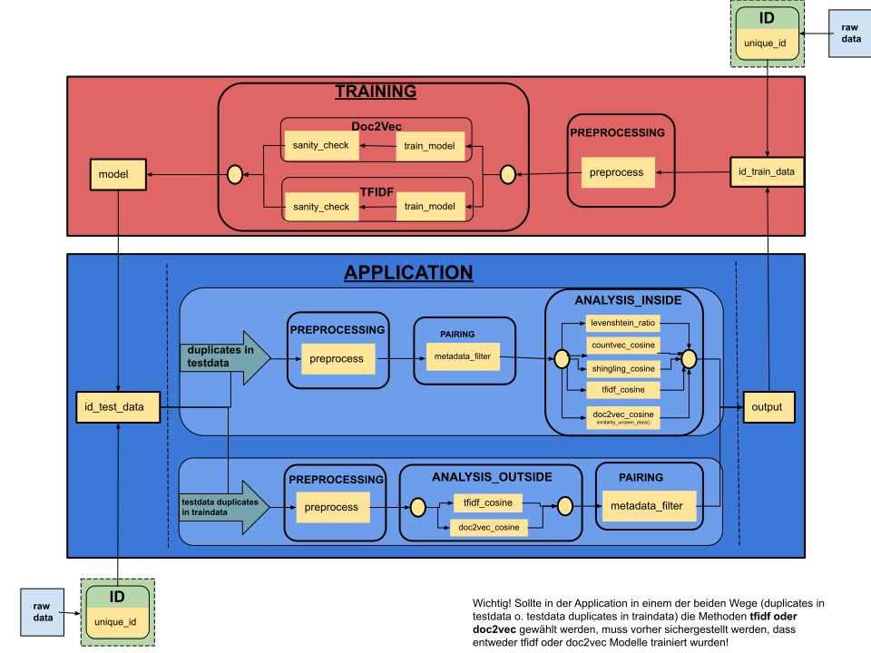

## Dokumentation Dubletten-Identifizierung📑💻
***
Das **dupli** ist ein Tool, um Dubletten in Stellenanzeigen-Datenbanken zu identifizieren. 
Es entstand im Rahmen einer Masterarbeit im Projekt [Quenfo](https://dh.phil-fak.uni-koeln.de/forschung/qualifikationsentwicklungsforschung) 
und in Kooperation mit dem Bundesinstitut für Berufsbildung.


**Zielsetzung:**

	a. Dubletten sollen innerhalb eines Datensatzes an Stellenanzeigen gefunden werden.
	b. Dubletten sollen für diesen Datensatz hinsichtlich älterer Daten gefunden werden.

**Input:**

	1. Trainingsdaten (SQL-Datenbank mit Stellenanzeigen (bspw. 2019)) (bekannte Daten)
	2. Testdaten (SQL-Datenbank mit Stellenanzeigen (bspw. 2020)) (neuere, unbekannte Daten)

**Hauptstruktur:**

	1. Id-Handling (vergibt unique_ids an die Input-Daten)
	2. Modeling (Training und Evaluierung von Doc2Vec oder TF-IDF Modellen)
	3. Application (Dubletten-Identifikation)

**Output:** SQL-Datenbank bestehend aus:

	1.  SQL-Tabelle mit Dubletten-Paaren gefunden innerhalb der Testdaten
	2.  SQL-Tabelle mit Dubletten-Paaren aus der Schnittmenge Testdaten und Trainingsdaten
***
### Quickstart🏃
***
Die Anwendung wurde in Python 3.7 geschrieben.

Klone das Repository

`git clone https://github.com/agerlac1/dupli.git`

cd in den Ordner **dupl/code**: hier liegt die requirements Datei und das Programm wird von hier ausgeführt.

`python -m pip install -r requirements`

Um die Stopword-Liste von NLTK nutzen zu können, muss folgende Zeile zusätzlich ausgeführt werden:

`python -m nltk.downloader stopwords`

Mit der nachfolgenden Ausführung wird das gesamte Programm samt Default-Settings aufgerufen (Pfade zu Testdaten und Trainingsdaten müssen zuvor in der config.yaml angegeben werden).

`python main.py all_in_one`

Informationen über die erfolgten Abläufe und Ergebnisse werden in der Datei `logger.log` gespeichert.

***
### Workflow🔁
***
In der folgenden Grafik ist der Workflow des Tools zur Dubletten-Identifikation zu sehen. Hierbei handelt es sich um einen iterativen Prozess, in dem die Output-Daten langfristig auch als Input-Daten fungieren sollen.

#### Allgemein
 
 Die Anwendung unterteilt sich in die zwei größeren Abschnitte Training (rot) und Application (blau). Das Training sowie die Application können nacheinander oder getrennt voneinander aufgerufen werden. Zu beachten ist hierbei jedoch, dass einige der Methoden aus der Application sich auf die im Training generierten Modelle beziehen. Das Ausführen des Programmes erfolgt über den Aufruf des Skriptes `main.py` durch das Command Line Interface (CLI), wobei zusätzliche Parameter übergeben werden können. Diese werden dann über einen Argument Parser  interpretiert und bestimmte Teile des Programms aufgerufen. 

#### Aufteilung Training & Application

Die Daten werden iterativ durch die Anwendung geleitet. Die Trainingsdaten fungieren hierbei als die „alten“ bereits bekannten Daten und werden zum Trainieren der Modelle und zum Abgleich für die neuen Daten verwendet. Deshalb wurde bei der Zusammenstellung der Trainingsdaten und der Testdaten darauf geachtet, dass die Testdaten aus dem Jahr 2020 und die Trainingsdaten aus den Jahren 2015-2019 stammen. 

> Testdaten = neu hinzukommende „unbekannte“ Daten (id_test_data.db)

> Trainingsdaten = bereits vorliegende „bekannte“ Daten (id_train_data.db)





#### Code Struktur
Der Code ist so struktuiert, dass sich die einzelnen Module (im Workflow s.o. erkennbar) ebenfalls in der Ordnerstruktur wiederfinden.
```
📦dupli
├── 📂code
│   ├── 📂analysis
│   │   ├── 📂analysis_inside (Zielsetzung a)
│   │   ├── 📂analysis_outside (Zielsetzung b)
│   │   ├── 📂pairing
│   │   └── 📜__init__.py
│   ├── 📂id_handling
│   ├── 📂input
│   │   ├── 📜input_test_data.db
│   │   └── 📜input_train_data.db
│   ├── 📂modeling
│   ├── 📂output
│   ├── 📂preprocessing
│   ├── 📂services
│   ├── 📂temp
│   ├── 📜config.yaml
│   ├── 📜logger.log
│   ├── 📜main.py
│   └── 📜requirements
├── 📂models
├── 📜flowchart.svg
└── 📜README.md
```

***
### Implementierung und Module 🛠️
***
#### Id-Handling
Das Modul vergibt für jeden Datensatz (bzw. Stellenanzeige) unique_ids und speichert diese in einer neuen Spalte "unique_id" in der Datenbank. Die zuletzt vergebene unique_id wird in der Datei `id_handling/last_unique_id.txt` gespeichert.

#### Services
1. `connection_preparations.py`: Script mit dem die connections zu den SQL-Datenbanken hergestellt werden (Input, Output und Backup-Dateien).
2. `manage_dfs.py`: Script um die SQL-Daten aus den connections auszulesen und in pandas.DataFrames zu schreiben. Außerdem werden hier Daten aus Dictionaries wieder mit den DataFrames zusammengeführt und Output-DataFrames erzeugt.

#### Support Module
1.  `preprocessing`: Vorverabeitung der Daten (lower case, stopword and punctuation removal, Tokenization and/or Tagging)
2. `pairing`: Um einen paarweisen Abgleich der Texte zu ermöglichen, bietet das Pairing-Modul eine Möglichkeit der Quadrierung der Daten entgegenzuwirken (z.B. 400² Stellenanzeigen = 160.000 potenzielle Paare). Pairing-Filter grenzt durch den Vergleich von fünf Metadaten die potenziellen Paare ein.
Der Filter kann in `config.yaml` manuell angepasst werden.

	 In der **analysis_inside** entsteht ein Datensatz (/temp) mit potentiellen Dublettenpaaren aus Stellenanzeigen, die paarweise an die Methoden weitergegeben werden können.
	 
	 In der **analysis_outside** gelangen die ähnlichsten Paare des vorherigen Schrittes ins Pairing. Hier wird dann entschieden, ob es sich endgültig um Dubletten-Paare oder Nicht-Dubletten-Paare handelt.

#### Modeling/Training
1. **Preprocessing**: Trainingsdaten (mit unique_ids) werden je nach Parametermitgabe (tfidf oder doc2vec) vorverarbeitet.
2. **Training**: Hier werden die vorverarbeiteten Trainingsdaten als Grundlage zum Training eines Modells genutzt. (Bei Doc2Vec ist noch ein Retraining möglich, indem das trainierte Modell mit den Testdaten nachträglich aktualisiert wird.)
3. **Sanity_check**: Überprüfung der Zuverlässigkeit der  Modelle. Ergebnisse davon werden in der Datei `logger.log` festgehalten.

#### Application/Analysis
Die zuvor trainierten Modelle dienen als Grundlage für die Analyse-Verfahren in der Application. Dieser Bereich ist entsprechend der Zielsetzung in zwei Prozesse aufgeteilt, die jeweils hellblau unterteilt sind. Die grünen Pfeile fassen die Zielsetzungen zusammen und verweisen auf die Module, die für die Verarbeitung der Daten durchlaufen werden müssen. 

1. Beim oberen Pfeil **"duplicates in testdata"** handelt es sich um die Zielsetzung a, bei der Dubletten innerhalb der unbekannten Testdaten gefunden werden sollen. Dafür wird die **analysis_inside** aufgerufen.

2. Beim unteren Pfeil **"testdata duplicates in traindata"** handelt es sich um die Zielsetzung b, bei der Dubletten der Testdaten hinsichtlich der Trainingsdaten identifiziert werden. Dafür wird die **analysis_outside** aufgerufen.

##### analysis_inside 
Ziel: Dubletten-Paare in den Testdaten finden.
1. **Preprocessing**: Hier werden die Testdaten vorverarbeitet (Backup-File in `/temp`).
2. **Pairing**: Die vorverarbeiteten Testdaten werden zu potenziellen Dubletten-Paaren verarbeitet, in einem DataFrame gespeichert und an die Methoden übergeben.
3. **analysis_inside**:  Je nach Parametermitgabe wird eine der fünf Methoden ausgewählt:

	a. Levenshtein-Ratio

	b. CountVectorizer & Kosinus-Ähnlichkeit

	c. Shingling & Jaccard/Kosinus-Ähnlichkeit
	
    d. TF-IDF & Kosinus-Ähnlichkeit (hier wird das trainierte Modell verwendet!)
	
    e. Doc2Vec & Kosinus-Ähnlichkeit (hier wird das trainierte Modell verwendet!)

	--> Die Ergebnis-Scores werden in der Evaluation mit einem Schwellenwert bemessen und als Output erhält man die Datei `/output/detected_duplicates.db` mit der Tabelle `testdata_output`, in der die Dubletten-Paare enthalten sind.

##### analysis_outside
Ziel: Dubletten-Paare für die Testdaten hinsichtlich der Trainingsdaten finden.
1. **Preprocessing**: Auch hier werden die Daten vorverarbeitet (je nach Auswahl, ob tfidf oder doc2vec) und dann weitergegeben.
2. **analysis_outside**: Hier werden die Testdaten mit dem jeweiligen Modell vektorisiert und die `most_similar()` Stellenanzeigen aus den Trainingsdaten ausgegeben.
> **Wichtig**: Wenn die Trainingsdaten hier andere unique_ids haben, als die mit denen das Doc2Vec-Modell trainiert wurde, wird dieser Schritt nicht funktionieren!

3. **Pairing**: Die ähnlichsten Paare des vorherigen Schrittes gelangen hier in den Metadaten-Filter. Die Paare, die durch den Filter gelangen, sind die gefundenen Dubletten-Paare.

	--> Der Output wird ebenfalls in der Datei `/output/detected_duplicates.db` gespeichert, aber diesmal in der Tabelle `traindata_output`.

Längerfristig ist vorgesehen, den Output so zu strukturieren, dass nicht die Dubletten enthalten sind, sondern die Testdaten/Neuen Daten von diesen Dubletten bereinigt werden und dann wieder als Input für einen neuen Trainingsprozess dienen. Dadurch kann das Modell (je nach Wahl TF-IDF oder Doc2Vec) upgedatet werden und dient dann im Folgejahr als Grundlage für die neuen Daten (bspw. 2021), die dann wieder bereinigt werden müssen (in Hinblick auf sich selbst und auf die alten Daten (dann 2020)). 
Somit schließt sich der Kreislauf. ♻️

**main.py**

Main-Skript des Tools. Hier befindet sich die grobe Architektur und Verwaltung des Programms. Des Weiteren sind hier die ArgumentParser Befehle deklariert, mit denen bestimmte Teile des Skriptes aufgerufen werden können (mehr dazu weiter unten).

**requirements**

Enthält eine Auflistung an Python-Dependencies, die benötigt werden, um das Tool auszuführen.

**logger.log**

Logging-File, in dem zusätzliche Informationen während der Ausführung des Tools gespeichert werden. Außerdem befinden sich hier die Evaluation-Reports und Sanity_checks.

**input/, output/, temp/**

Ordner, in denen die Input, Output und Temp-Dateien liegen. Wenn andere Pfade für die Dateien verwendet werden sollen, müssen diese in der config.yaml Datei angepasst werden.

***
### Configuration📋✔️
***
In der Datei config.yaml sind alle Pfade, einstellbare Parameter und der Metadaten-Filter vermerkt. Dadurch wird gewährleistet, dass im Code selbst für eine Anwendung nichts verändert werden muss. Alle Änderungen werden in der `config.yaml` Datei vorgenommen.

**Im aktuellen Zustand befindet sich das Programm in der "Werkseinstellung" und es können nach Belieben Modelle trainiert und Daten analysiert werden (mit entsprechenden Pfadangaben zu Test- und Trainingsdaten).**

Ansonsten können folgende Werte angepasst werden:

1. Andere **Input-Dateien** auswählen:

	- `train_data` und `test_data`

2. Andere **Output-Datei** auswählen:

	- `output_path`

3. Andere **Temp-Dateien** und Pfade festlegen für Dateien, die schon unique_ids bekommen haben:

	- `id_train_data` und `id_test_data`

4. Auswählen, ob für den Prozess ein **trained** oder **retrained Doc2Vec Modell** verwendet wird (nur relevant, wenn Doc2Vec verwendet wird):

	- `d2v_model_type` -> `type` 

	entweder 'd2v_model' für trained Modell oder 'd2v_remodel' für retrained Modell.

5. **Modellpfade** festlegen:

	**a. Doc2Vec Modell Pfade**:

	-> `model_path` festlegen. Hier wird das trainierte Modell abgelegt oder das Modell für die Analyse aufgerufen. Wird überschrieben, wenn neu trainiert wird.

	-> `retrained_model_path` festlegen. Hier wird das retrained Modell abgelegt (ein zuvor 	trainiertes muss unter model_path liegen). Wird überschrieben, wenn neu retrained wird.

	**b. TF-IDF Model Pfade:**
	- `tfidf_model_path` festlegen. Hier wird das trainierte Modell abgelegt oder das Modell für die Analyse aufgerufen. Wird überschrieben, wenn neu trainiert wird.

6. **Parameter** für das **Doc2Vec modeling** festlegen:
	- `doc2vec_model` (hier können vector_size, min_count, epochs und alpha festgelegt werden)

7. **Parameter** für das **TF-IDF fitting** festlegen:
	- `tfidf_model` (hier kann der Parameter *sublinear_tf* auf *false* oder *true* gesetzt werden, zur unterschiedlichen Berechnung der Term Frequency im TF-IDF fitting)

8. **Support-Dateien**

    a. Unter dem value `id_support` wird der Pfad zu der Datei `last_unique_id.txt` festgelegt. Hier wird die zuletzt verwendete unique_id gespeichert. Sollte möglichst nicht verändert werden, damit gewährleistet werden kann, dass keine id mehrfach vergeben wird. Sollte das id_handling für einen Datensatz wiederholt werden, muss die Datei manuell auf die letzte unique_id vor diesem Datensatz zurückgesetzt werden.
	
    b. Unter `solution_annotated` befindet sich die für die Masterarbeit relevante Annotation der Testdaten, weshalb überhaupt ein Evaluation-Report möglich ist. Bei anderen Testdaten als Input, wird kein Evaluation-Report erstellt. Das Auffinden von Dubletten funktioniert allerdings weiterhin.

9. **Data-Handling**

	--> Hier kann festgelegt werden, welche Tabellen in welcher Menge aus einer SQL-Datenbank ausgelesen werden sollen.

	a. Es gibt einen Filter `filter_tablename` mit dem bestimmte Tabellen ausgeschlossen werden können. Bspw. alle Tabellen, die das Jahr 2020 im Namen enthalten, werden ignoriert. 
	 
	 b. Um die großen Datenmengen verarbeiten zu können, kann eine `chunk_size` und eine max. Anzahl an Zeilen festgelegt werden, die aus einer Tabelle ausgelesen werden sollen. Die Limitierung ist für die Masterarbeit relevant. Wenn `countermax_per_table` auf 0 gesetzt wird, wird die Tabelle komplett ausgelesen.

10. **Metadaten-Filter** für das Pairing

- Filter bei dem die Stellenanzeigen _paarweise_ miteinander verglichen werden und je nach Filtersetzung als potentielle Dublettenpaare weitergeleitet werden.

	**a. Veröffentlichungsdatum `date` -> `past` und `future`:**

		Intervall in dem Stellenanzeigen als Dubletten gelten (in Tagen), abhängig vom Veröffentlichungsdatum:
		 
		 past-date --> current-date (Stellenanzeige A) --> future-date
		 
		Liegt das Veröffentlichungsdatum von Stellenanzeige B in dem vorher definierten Intervall, wird das Paar in den nächsten Filter weitergeleitet.
	 	


- !Filter (a) gilt als UND Bedingung für alle drei folgenden Faktoren.

	**b. Volltexte `full_text`**

		Stellenanzeigen, die identische Texte haben, werden als potentielle Dubletten gewertet.

	**c. Location_name `location_name`**

		Stellenanzeigen, die die gleichen location_names haben, werden als potentielle Dubletten gewertet.
    
	**d. Profession_isco_code & advertiser_name `profisco_advname`**

		Stellenanzeigen, die die gleiche prof_isco und/oder den gleichen advertiser_name haben, werden als Dubletten gewertet.

- Filter kann auch ausgeschaltet werden (date auf 0 und die anderen auf false setzen), aber dann wird jede mit jeder als Paar weitergeleitet und der Rechenaufwand ist enorm. Es wird empfohlen den Filter so zu lassen.

***
### CommandLine - Befehle📢
***
Alle Befehle werden relativ zum Ordner `code/` ausgeführt.

**Grundsätzlich:** 

	usage: main.py [-h] {id_handling,modeling,analyze,all_in_one} ...

	Find Duplicates in job-ads

	positional arguments:
 	 {id_handling,modeling,analyze,all_in_one}

#### 1. **All_in_one**

Das Tool komplett durchlaufen lassen:

	usage: main.py all_in_one [-h] [--modeling_type {tfidf,doc2vec}] [--test]
                          [--train] [--preprocessing] [--pairing]
                          [--calculation] [--jaccard] [--evaluation]
                          [--mostsim] [--training] [--retraining]
                          [--sanity_check] [--method_out {doc2vec,tfidf}]
                          [--method_in {levenshtein,countvec,tfidf,doc2vec,shingling}]
                          [--analysis_type {inside,outside,complete}]

	optional arguments:
	  -h, --help            show this help message and exit
	  --modeling_type {tfidf,doc2vec}
	  --test
	  --train
	  --preprocessing
	  --pairing
	  --calculation
	  --jaccard
	  --evaluation
	  --mostsim
	  --training
	  --retraining
	  --sanity_check
	  --method_out {doc2vec,tfidf}
	  --method_in {levenshtein,countvec,tfidf,doc2vec,shingling}
	  --analysis_type {inside,outside,complete}

**Beispielsyntax:**

Mit Doc2Vec (als Default-Einstellung):

        python main.py all_in_one

- unique_ids werden an Test- und Trainingsdaten vergeben
- Ein Doc2Vec Modell wird trainiert
- Die Application verarbeitet die Daten mithilfe des Doc2Vec-Modells.

Mit TF-IDF:

        python main.py all_in_one --modeling_type tfidf --method_in tfidf --method_out tfidf

- So wird der obige Prozess für das ganze Programm ausgeführt (ids, training, application), aber mit tfidf.

**Einzelne Teile des Tools spezifizierter aufrufen:**

#### 2. **id_handling**

	usage: main.py id_handling [-h] [--test] [--train]

	gives unique_ids to input-data (Trainingdata and Testdata) and stores them in
	'/temp/id_test_data.db' and '/temp/id_train_data.db'

	optional arguments:
	  -h, --help  show this help message and exit
	  --test
	  --train

**Beispielsyntax:**

		 python main.py id_handling 

-> Vergibt unique_ids an Testdaten und Trainingsdaten

#### 3. **modeling** (id_handling muss vorher gelaufen sein)

	usage: main.py modeling [-h] [--modeling_type {tfidf,doc2vec}] [--training]
							[--retraining] [--sanity_check]

	trains, retrains and checks sanity of models --> models saved in folder
	dupl/models (one level higher than working_dir)

	optional arguments:
	  -h, --help            show this help message and exit
	  --modeling_type {tfidf,doc2vec}
	  --training
	  --retraining
	  --sanity_check

**Beispielsyntax:**

a. Man möchte ein Doc2Vec-Modell trainieren, retrainen und einen sanity_check durchführen (Default-Einstellung)

			python main.py modeling
               
b. Man möchte ein Doc2Vec-Modell trainieren und den Sanity_check danach vornehmen (kein Retraining)

			python main.py modeling --modeling_type doc2vec --training --sanity_check

c. Man möchte ein TF-IDF-Modell trainieren und den Sanity_check danach vornehmen

			python main.py modeling --modeling_type tfidf --training --sanity_check

oder

			python main.py modeling --modeling_type tfidf

#### 4. **analysis** (id_handling und modeling muss vorher gelaufen sein)

	usage: main.py analyze [-h] [--preprocessing] [--pairing] [--calculation]
						   [--evaluation] [--jaccard] [--mostsim]
						   [--method_out {doc2vec,tfidf}]
						   [--method_in {levenshtein,countvec,tfidf,doc2vec,shingling}]
						   [--analysis_type {inside,outside,complete}]

	optional arguments:
	  -h, --help            show this help message and exit
	  --preprocessing
	  --pairing
	  --calculation
	  --evaluation
	  --jaccard
	  --mostsim
	  --method_out {doc2vec,tfidf}
	  --method_in {levenshtein,countvec,tfidf,doc2vec,shingling}
	  --analysis_type {inside,outside,complete}

**Beispielsyntax:**

**a. Gesamt:** Man ruft den Application Prozess auf (inside und outside)
            
			python main.py analyze

**b. analysis_inside:** Wenn der Teil --analysis_type inside involviert ist oder auch alleine aufgerufen wird:

			python main.py analyze --analysis_type inside

Man möchte die analysis_inside Analyse mit der Levenshtein-Methode machen:

			 python main.py analyze --analsis_type inside --method_in levenshtein

Man möchte die analysis_inside Analyse mit der Shingling-Methode machen. Wenn nicht die Kosinus-Ähnlichkeit als Maß benutzt werden, sondern Jaccard, kann --jaccard hinzugefügt werden:

			 python main.py analyze --analysis_type inside --method_in shingling


 **c. analysis_outside:** Wenn der Teil --analysis_type outside involviert ist oder auch alleine aufgerufen wird:
 
 			python main.py analyze --analysis_type outside

Man möchte die analysis_outside Analyse mit der Methode tfidf ausführen:

			python main.py analyze --analysis_type outside --method_out tfidf

Oder man möchte die analysis_outside Analyse mit der Methode doc2vec ausführen:

            	python main.py analyze --analysis_type outside 
oder

           		python main.py analyze --analysis_type outside --method_out doc2vec

***
### Input Daten📚
***
Als Input-Dateien müssen SQL-Datenbanken vorliegen. Die Benennung der darin verzeichneten Tabellen ist irrelevant. Die Daten müssen mindestens über folgende Metadaten verfügen, damit sie als Input-Daten verwendet werden können (egal ob als Test- oder Trainingsdaten):

- full_text

- location_name

- date

- profession_isco_code

- advertiser_name

***
### ID-Handling🧮
***

Bisher vergebene last_unique_ids:

Last_unique_id nach Jobs:

    250D28

Last_unique_id nach Postings:

    384708

Last_unique_id nach Testdaten (backup_id_test_data.db):

    384898


***
### Replikation der Masterarbeit 👩‍🎓📜
***
Zur **Replikation der Masterarbeit** müssen entsprechende Pfade für die Input-Dateien und die Modelle geändert werden in **config.yaml**:

**Testdaten:**

-> `id_test: 'temp/backup_id_test_data.db'`

**Trainingsdaten (a ODER b):**

a. `id_train: 'temp/backup_jobs_id_train_data.db'` 

b. `id_train: 'temp/backup_postings_id_train_data.db'`

-> `id_train` entweder zu a oder b ändern/auskommentieren. Je nachdem, welches Modell genutzt werden soll (jobs oder postings).

**Modell-Pfade:**

Die zusätzlich gesendeten Modelle sollten bestenfalls in den Ordner `models/models_doc2vec/models_backup` entzippt gelegt werden. Dann müssen die Pfade nicht verändert, sondern nur auskommentiert werden.

**Erinnerung:**
1. Wenn jobs als Input-Trainingsdaten (a. id_train) gewählt werden -> auch jobs-Modell auswählen
2. Wenn postings als Input-Trainingsdaten (b. id_train) gewählt werden -> auch postings-Modell auswählen
3. Für Doc2Vec: d2v_model oder d2v_remodel je nach Type des Modells (trained oder retrained).


**!Anmerkung:** Aufgrund der Größe der Datenbanken konnten nicht die kompletten Dateien hier hochgeladen werden. Eigentlich enthalten die Files: 
`temp/backup_jobs_id_train_data.db` , `temp/backup_postings_id_train_data.db` 14 GB. Die hier im `temp/` gelagerten Dateien beinhalten nur einen kleinen Ausschnitt. Nur so kann die analysis_outside nachvollzogen werden, da das in der Masterarbeit trainierte Modell die unique_ids der 14GB Daten enthält.

**CommandLine Befehl um die Application für die Masterarbeit zu replizieren**

        python main.py analyze

Wenn gewünscht, können dann noch die genaueren Settings gesetzt werden: 
Ansonsten wird wie gehabt die analysis mit doc2vec in beiden Strategien (inside & outside) aufgerufen.

            # Inside 
             --method_in
                Choose:
                    levenshtein
                    countvec
                    tfidf
                    doc2vec
                    shingling
            
            # Outside
            --method_out (default: doc2vec)
                Choose:
                    tfidf
                    doc2vec